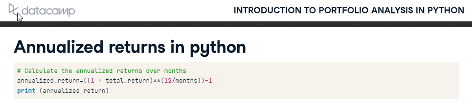

```python
# data: HM Land Registry
# url: https://www.gov.uk/government/statistical-data-sets/price-paid-data-downloads#yearly-file
# created by: Neel Patel
# email neel@quarithm.com
```

The functions in this notebook have been saved in the uk_res_sales.py file and can be called by importing them.


```python
import numpy as np
import pandas as pd

import warnings
warnings.filterwarnings("ignore")
```


```python
# Column names according to HM Land registry explanation of what the columns represent:
# https://www.gov.uk/guidance/about-the-price-paid-data#explanations-of-column-headers-in-the-ppd

c_names = ['Transaction_id','Price','Date','Postcode','Type','is_new','Duration','PAON','SAON','Street','Locality','Town_City','District','County','Price_Paid_Cat','Record_Status']
```

 - Data for 1995, 1996 & 1997 downloaded in '.csv' format and loaded using pandas


```python
# Loading 3 years of data from 6 files into a list of DataFrames, the 'c_names' list used for column names
```


```python
df_list = []
df_list.append(pd.read_csv('./data/pp-1995-part1.csv',names=c_names))
df_list.append(pd.read_csv('./data/pp-1995-part2.csv',names=c_names))
df_list.append(pd.read_csv('./data/pp-1996-part1.csv',names=c_names))
df_list.append(pd.read_csv('./data/pp-1996-part2.csv',names=c_names))
df_list.append(pd.read_csv('./data/pp-1997-part1.csv',names=c_names))
df_list.append(pd.read_csv('./data/pp-1997-part2.csv',names=c_names))
```

 - At this stage I would be exploring the data and looking to clean the data.


```python
df_list[0].head()
```


<div>
<style scoped>
    .dataframe tbody tr th:only-of-type {
        vertical-align: middle;
    }

    .dataframe tbody tr th {
        vertical-align: top;
    }

    .dataframe thead th {
        text-align: right;
    }
</style>
<table border="1" class="dataframe">
  <thead>
    <tr style="text-align: right;">
      <th></th>
      <th>Transaction_id</th>
      <th>Price</th>
      <th>Date</th>
      <th>Postcode</th>
      <th>Type</th>
      <th>is_new</th>
      <th>Duration</th>
      <th>PAON</th>
      <th>SAON</th>
      <th>Street</th>
      <th>Locality</th>
      <th>Town_City</th>
      <th>District</th>
      <th>County</th>
      <th>Price_Paid_Cat</th>
      <th>Record_Status</th>
    </tr>
  </thead>
  <tbody>
    <tr>
      <th>0</th>
      <td>{A42E2F04-2538-4A25-94C5-49E29C6C8FA8}</td>
      <td>18500</td>
      <td>1995-01-31 00:00</td>
      <td>TQ1 1RY</td>
      <td>F</td>
      <td>N</td>
      <td>L</td>
      <td>VILLA PARADISO</td>
      <td>FLAT 10</td>
      <td>HIGHER WARBERRY ROAD</td>
      <td>TORQUAY</td>
      <td>TORQUAY</td>
      <td>TORBAY</td>
      <td>TORBAY</td>
      <td>A</td>
      <td>A</td>
    </tr>
    <tr>
      <th>1</th>
      <td>{1BA349E3-2579-40D6-999E-49E2A25D2284}</td>
      <td>73450</td>
      <td>1995-10-09 00:00</td>
      <td>L26 7XJ</td>
      <td>D</td>
      <td>Y</td>
      <td>F</td>
      <td>6</td>
      <td>NaN</td>
      <td>CATKIN ROAD</td>
      <td>LIVERPOOL</td>
      <td>LIVERPOOL</td>
      <td>KNOWSLEY</td>
      <td>MERSEYSIDE</td>
      <td>A</td>
      <td>A</td>
    </tr>
    <tr>
      <th>2</th>
      <td>{E5B50DCB-BC7A-4E54-B167-49E2A6B4148B}</td>
      <td>59000</td>
      <td>1995-03-31 00:00</td>
      <td>BH12 2AE</td>
      <td>D</td>
      <td>N</td>
      <td>F</td>
      <td>28</td>
      <td>NaN</td>
      <td>ALDER ROAD</td>
      <td>POOLE</td>
      <td>POOLE</td>
      <td>POOLE</td>
      <td>POOLE</td>
      <td>A</td>
      <td>A</td>
    </tr>
    <tr>
      <th>3</th>
      <td>{81E50116-D675-4B7F-9F8D-49E2B5D43271}</td>
      <td>31000</td>
      <td>1995-12-04 00:00</td>
      <td>IP13 0DR</td>
      <td>D</td>
      <td>Y</td>
      <td>F</td>
      <td>NONSUCH COTTAGE</td>
      <td>NaN</td>
      <td>THE STREET</td>
      <td>HACHESTON</td>
      <td>WOODBRIDGE</td>
      <td>SUFFOLK COASTAL</td>
      <td>SUFFOLK</td>
      <td>A</td>
      <td>A</td>
    </tr>
    <tr>
      <th>4</th>
      <td>{B97455B9-75CB-40BB-A615-42C53683E143}</td>
      <td>95000</td>
      <td>1995-09-22 00:00</td>
      <td>WS14 0BE</td>
      <td>D</td>
      <td>N</td>
      <td>F</td>
      <td>FOX COVER COTTAGE</td>
      <td>NaN</td>
      <td>HALL LANE</td>
      <td>LICHFIELD</td>
      <td>LICHFIELD</td>
      <td>LICHFIELD</td>
      <td>STAFFORDSHIRE</td>
      <td>A</td>
      <td>A</td>
    </tr>
  </tbody>
</table>
</div>


```python
df_list[0].info()
```

    <class 'pandas.core.frame.DataFrame'>
    RangeIndex: 398343 entries, 0 to 398342
    Data columns (total 16 columns):
     #   Column          Non-Null Count   Dtype 
    ---  ------          --------------   ----- 
     0   Transaction_id  398343 non-null  object
     1   Price           398343 non-null  int64 
     2   Date            398343 non-null  object
     3   Postcode        398031 non-null  object
     4   Type            398343 non-null  object
     5   is_new          398343 non-null  object
     6   Duration        398343 non-null  object
     7   PAON            398331 non-null  object
     8   SAON            30769 non-null   object
     9   Street          392037 non-null  object
     10  Locality        390457 non-null  object
     11  Town_City       398343 non-null  object
     12  District        398343 non-null  object
     13  County          398343 non-null  object
     14  Price_Paid_Cat  398343 non-null  object
     15  Record_Status   398343 non-null  object
    dtypes: int64(1), object(15)
    memory usage: 48.6+ MB
    


```python
# concatenating the list of dataframes into one.
combined_df = pd.concat(df_list).drop_duplicates().reset_index(drop=True)
```


```python
combined_df.head()
```


<div>
<style scoped>
    .dataframe tbody tr th:only-of-type {
        vertical-align: middle;
    }

    .dataframe tbody tr th {
        vertical-align: top;
    }

    .dataframe thead th {
        text-align: right;
    }
</style>
<table border="1" class="dataframe">
  <thead>
    <tr style="text-align: right;">
      <th></th>
      <th>Transaction_id</th>
      <th>Price</th>
      <th>Date</th>
      <th>Postcode</th>
      <th>Type</th>
      <th>is_new</th>
      <th>Duration</th>
      <th>PAON</th>
      <th>SAON</th>
      <th>Street</th>
      <th>Locality</th>
      <th>Town_City</th>
      <th>District</th>
      <th>County</th>
      <th>Price_Paid_Cat</th>
      <th>Record_Status</th>
    </tr>
  </thead>
  <tbody>
    <tr>
      <th>0</th>
      <td>{A42E2F04-2538-4A25-94C5-49E29C6C8FA8}</td>
      <td>18500</td>
      <td>1995-01-31 00:00</td>
      <td>TQ1 1RY</td>
      <td>F</td>
      <td>N</td>
      <td>L</td>
      <td>VILLA PARADISO</td>
      <td>FLAT 10</td>
      <td>HIGHER WARBERRY ROAD</td>
      <td>TORQUAY</td>
      <td>TORQUAY</td>
      <td>TORBAY</td>
      <td>TORBAY</td>
      <td>A</td>
      <td>A</td>
    </tr>
    <tr>
      <th>1</th>
      <td>{1BA349E3-2579-40D6-999E-49E2A25D2284}</td>
      <td>73450</td>
      <td>1995-10-09 00:00</td>
      <td>L26 7XJ</td>
      <td>D</td>
      <td>Y</td>
      <td>F</td>
      <td>6</td>
      <td>NaN</td>
      <td>CATKIN ROAD</td>
      <td>LIVERPOOL</td>
      <td>LIVERPOOL</td>
      <td>KNOWSLEY</td>
      <td>MERSEYSIDE</td>
      <td>A</td>
      <td>A</td>
    </tr>
    <tr>
      <th>2</th>
      <td>{E5B50DCB-BC7A-4E54-B167-49E2A6B4148B}</td>
      <td>59000</td>
      <td>1995-03-31 00:00</td>
      <td>BH12 2AE</td>
      <td>D</td>
      <td>N</td>
      <td>F</td>
      <td>28</td>
      <td>NaN</td>
      <td>ALDER ROAD</td>
      <td>POOLE</td>
      <td>POOLE</td>
      <td>POOLE</td>
      <td>POOLE</td>
      <td>A</td>
      <td>A</td>
    </tr>
    <tr>
      <th>3</th>
      <td>{81E50116-D675-4B7F-9F8D-49E2B5D43271}</td>
      <td>31000</td>
      <td>1995-12-04 00:00</td>
      <td>IP13 0DR</td>
      <td>D</td>
      <td>Y</td>
      <td>F</td>
      <td>NONSUCH COTTAGE</td>
      <td>NaN</td>
      <td>THE STREET</td>
      <td>HACHESTON</td>
      <td>WOODBRIDGE</td>
      <td>SUFFOLK COASTAL</td>
      <td>SUFFOLK</td>
      <td>A</td>
      <td>A</td>
    </tr>
    <tr>
      <th>4</th>
      <td>{B97455B9-75CB-40BB-A615-42C53683E143}</td>
      <td>95000</td>
      <td>1995-09-22 00:00</td>
      <td>WS14 0BE</td>
      <td>D</td>
      <td>N</td>
      <td>F</td>
      <td>FOX COVER COTTAGE</td>
      <td>NaN</td>
      <td>HALL LANE</td>
      <td>LICHFIELD</td>
      <td>LICHFIELD</td>
      <td>LICHFIELD</td>
      <td>STAFFORDSHIRE</td>
      <td>A</td>
      <td>A</td>
    </tr>
  </tbody>
</table>
</div>


```python
combined_df.tail()
```


<div>
<style scoped>
    .dataframe tbody tr th:only-of-type {
        vertical-align: middle;
    }

    .dataframe tbody tr th {
        vertical-align: top;
    }

    .dataframe thead th {
        text-align: right;
    }
</style>
<table border="1" class="dataframe">
  <thead>
    <tr style="text-align: right;">
      <th></th>
      <th>Transaction_id</th>
      <th>Price</th>
      <th>Date</th>
      <th>Postcode</th>
      <th>Type</th>
      <th>is_new</th>
      <th>Duration</th>
      <th>PAON</th>
      <th>SAON</th>
      <th>Street</th>
      <th>Locality</th>
      <th>Town_City</th>
      <th>District</th>
      <th>County</th>
      <th>Price_Paid_Cat</th>
      <th>Record_Status</th>
    </tr>
  </thead>
  <tbody>
    <tr>
      <th>2855405</th>
      <td>{E34EBCBB-7A3E-42FA-B982-C8528A26AD8F}</td>
      <td>35949</td>
      <td>1997-03-26 00:00</td>
      <td>TN39 3ER</td>
      <td>F</td>
      <td>N</td>
      <td>L</td>
      <td>88</td>
      <td>GROUND FLOOR FLAT</td>
      <td>WICKHAM AVENUE</td>
      <td>BEXHILL-ON-SEA</td>
      <td>BEXHILL-ON-SEA</td>
      <td>ROTHER</td>
      <td>EAST SUSSEX</td>
      <td>A</td>
      <td>A</td>
    </tr>
    <tr>
      <th>2855406</th>
      <td>{D4E6167D-E1F3-4597-B2FE-C8529B6310D1}</td>
      <td>39500</td>
      <td>1997-09-29 00:00</td>
      <td>PR25 2TQ</td>
      <td>T</td>
      <td>N</td>
      <td>F</td>
      <td>1</td>
      <td>NaN</td>
      <td>WELLFIELD AVENUE</td>
      <td>LEYLAND</td>
      <td>LEYLAND</td>
      <td>SOUTH RIBBLE</td>
      <td>LANCASHIRE</td>
      <td>A</td>
      <td>A</td>
    </tr>
    <tr>
      <th>2855407</th>
      <td>{B15B3FA4-4E8D-435F-8572-CC201767AF3C}</td>
      <td>114950</td>
      <td>1997-08-14 00:00</td>
      <td>HA2 9DP</td>
      <td>T</td>
      <td>N</td>
      <td>F</td>
      <td>10</td>
      <td>NaN</td>
      <td>TITHE FARM CLOSE</td>
      <td>HARROW</td>
      <td>HARROW</td>
      <td>HARROW</td>
      <td>GREATER LONDON</td>
      <td>A</td>
      <td>A</td>
    </tr>
    <tr>
      <th>2855408</th>
      <td>{584B77C1-434F-46D7-8001-CC2019E4725F}</td>
      <td>46000</td>
      <td>1997-09-05 00:00</td>
      <td>TF1 6XD</td>
      <td>D</td>
      <td>N</td>
      <td>L</td>
      <td>3</td>
      <td>NaN</td>
      <td>JAPONICA DRIVE</td>
      <td>LEEGOMERY</td>
      <td>TELFORD</td>
      <td>THE WREKIN</td>
      <td>SHROPSHIRE</td>
      <td>A</td>
      <td>A</td>
    </tr>
    <tr>
      <th>2855409</th>
      <td>{2E5616B5-A151-491F-A76B-CC203120FBBD}</td>
      <td>46000</td>
      <td>1997-01-08 00:00</td>
      <td>BD16 2RJ</td>
      <td>S</td>
      <td>N</td>
      <td>F</td>
      <td>9</td>
      <td>NaN</td>
      <td>BAILEY HILLS ROAD</td>
      <td>BINGLEY</td>
      <td>BINGLEY</td>
      <td>BRADFORD</td>
      <td>WEST YORKSHIRE</td>
      <td>A</td>
      <td>A</td>
    </tr>
  </tbody>
</table>
</div>


```python
# looking at information on the combined dataframe
combined_df.info()
```

    <class 'pandas.core.frame.DataFrame'>
    RangeIndex: 2855410 entries, 0 to 2855409
    Data columns (total 16 columns):
     #   Column          Dtype 
    ---  ------          ----- 
     0   Transaction_id  object
     1   Price           int64 
     2   Date            object
     3   Postcode        object
     4   Type            object
     5   is_new          object
     6   Duration        object
     7   PAON            object
     8   SAON            object
     9   Street          object
     10  Locality        object
     11  Town_City       object
     12  District        object
     13  County          object
     14  Price_Paid_Cat  object
     15  Record_Status   object
    dtypes: int64(1), object(15)
    memory usage: 348.6+ MB
    


```python
combined_df['County'].value_counts()
```


    GREATER LONDON                         401829
    GREATER MANCHESTER                     116109
    WEST MIDLANDS                          105309
    WEST YORKSHIRE                         101715
    KENT                                    87645
                                            ...  
    CITY OF PETERBOROUGH                      141
    BEDFORD                                   129
    CENTRAL BEDFORDSHIRE                      120
    ISLES OF SCILLY                            89
    BOURNEMOUTH, CHRISTCHURCH AND POOLE        42
    Name: County, Length: 128, dtype: int64


# Most expensive houses by county


Implement a function that will take price paid data and return another DataFrame containing the
full details of the largest transaction occurring within each county present in the data.


```python
def max_exp_house_county(data):
    '''
    This function takes price paid data and returns another DataFrame containing the full details of the largest
    transaction occuring within each county present in the data
    
    '''
    
    
    #group by 'County' and for each County return row with max price (includes where more than one property has max value)
    df = data.groupby(['County',], sort=True).apply(lambda df: df.loc[df['Price'] == df['Price'].copy().max()])
    return df
    #return data.groupby('County').apply(lambda df: df.loc[df['Price'].idxmax()])
```


```python
#There are 128 unique Counties
len(combined_df['County'].unique())
```


    128


```python
# Calling max_exp_house_country function

#result_df = max_exp_house_county(combined_df.iloc[:500000,:])
result_df = max_exp_house_county(df_list[0])
#df_list[0].iloc[:120000,:]
```


```python
result_df
```


<div>
<style scoped>
    .dataframe tbody tr th:only-of-type {
        vertical-align: middle;
    }

    .dataframe tbody tr th {
        vertical-align: top;
    }

    .dataframe thead th {
        text-align: right;
    }
</style>
<table border="1" class="dataframe">
  <thead>
    <tr style="text-align: right;">
      <th></th>
      <th></th>
      <th>Transaction_id</th>
      <th>Price</th>
      <th>Date</th>
      <th>Postcode</th>
      <th>Type</th>
      <th>is_new</th>
      <th>Duration</th>
      <th>PAON</th>
      <th>SAON</th>
      <th>Street</th>
      <th>Locality</th>
      <th>Town_City</th>
      <th>District</th>
      <th>County</th>
      <th>Price_Paid_Cat</th>
      <th>Record_Status</th>
    </tr>
    <tr>
      <th>County</th>
      <th></th>
      <th></th>
      <th></th>
      <th></th>
      <th></th>
      <th></th>
      <th></th>
      <th></th>
      <th></th>
      <th></th>
      <th></th>
      <th></th>
      <th></th>
      <th></th>
      <th></th>
      <th></th>
      <th></th>
    </tr>
  </thead>
  <tbody>
    <tr>
      <th>AVON</th>
      <th>327772</th>
      <td>{23969ADF-9C4C-443C-AB99-62A936BC477B}</td>
      <td>795000</td>
      <td>1995-05-24 00:00</td>
      <td>BA1 9AF</td>
      <td>D</td>
      <td>N</td>
      <td>F</td>
      <td>TOWER HOUSE</td>
      <td>NaN</td>
      <td>NaN</td>
      <td>KELSTON</td>
      <td>BATH</td>
      <td>BATH</td>
      <td>AVON</td>
      <td>A</td>
      <td>A</td>
    </tr>
    <tr>
      <th rowspan="2" valign="top">BATH AND NORTH EAST SOMERSET</th>
      <th>26167</th>
      <td>{488C127E-C24E-4A3E-847E-4A525B965A54}</td>
      <td>205000</td>
      <td>1995-07-31 00:00</td>
      <td>BA2 5AT</td>
      <td>D</td>
      <td>N</td>
      <td>F</td>
      <td>FOX HILL LODGE</td>
      <td>NaN</td>
      <td>FOX HILL</td>
      <td>NaN</td>
      <td>BATH</td>
      <td>BATH AND NORTH EAST SOMERSET</td>
      <td>BATH AND NORTH EAST SOMERSET</td>
      <td>A</td>
      <td>A</td>
    </tr>
    <tr>
      <th>318083</th>
      <td>{ECAB787E-FEB6-450D-A0FD-3ECFEF9A67D3}</td>
      <td>205000</td>
      <td>1995-01-16 00:00</td>
      <td>BA2 6SU</td>
      <td>D</td>
      <td>N</td>
      <td>F</td>
      <td>REDCLIFFE</td>
      <td>NaN</td>
      <td>BATHAMPTON LANE</td>
      <td>BATHAMPTON</td>
      <td>BATH</td>
      <td>BATH AND NORTH EAST SOMERSET</td>
      <td>BATH AND NORTH EAST SOMERSET</td>
      <td>A</td>
      <td>A</td>
    </tr>
    <tr>
      <th>BEDFORDSHIRE</th>
      <th>175596</th>
      <td>{A2722935-4779-4E96-8636-917D37D2B769}</td>
      <td>765000</td>
      <td>1995-01-31 00:00</td>
      <td>LU6 2LH</td>
      <td>D</td>
      <td>N</td>
      <td>F</td>
      <td>COVINGTON</td>
      <td>NaN</td>
      <td>NaN</td>
      <td>WHIPSNADE</td>
      <td>DUNSTABLE</td>
      <td>SOUTH BEDFORDSHIRE</td>
      <td>BEDFORDSHIRE</td>
      <td>A</td>
      <td>A</td>
    </tr>
    <tr>
      <th>BERKSHIRE</th>
      <th>330135</th>
      <td>{7F530EC8-6C2A-440E-9108-5F2E579D1527}</td>
      <td>700000</td>
      <td>1995-11-24 00:00</td>
      <td>RG7 6NS</td>
      <td>D</td>
      <td>N</td>
      <td>F</td>
      <td>NINE ELMS</td>
      <td>NaN</td>
      <td>THE AVENUE</td>
      <td>BUCKLEBURY</td>
      <td>READING</td>
      <td>NEWBURY</td>
      <td>BERKSHIRE</td>
      <td>A</td>
      <td>A</td>
    </tr>
    <tr>
      <th>...</th>
      <th>...</th>
      <td>...</td>
      <td>...</td>
      <td>...</td>
      <td>...</td>
      <td>...</td>
      <td>...</td>
      <td>...</td>
      <td>...</td>
      <td>...</td>
      <td>...</td>
      <td>...</td>
      <td>...</td>
      <td>...</td>
      <td>...</td>
      <td>...</td>
      <td>...</td>
    </tr>
    <tr>
      <th>WOKINGHAM</th>
      <th>49598</th>
      <td>{DAC5C262-6B7C-4C04-A6EB-105053545C07}</td>
      <td>525000</td>
      <td>1995-08-04 00:00</td>
      <td>RG10 8PX</td>
      <td>D</td>
      <td>N</td>
      <td>F</td>
      <td>THISTLE HOUSE</td>
      <td>NaN</td>
      <td>NaN</td>
      <td>CRAZIES HILL</td>
      <td>READING</td>
      <td>WOKINGHAM</td>
      <td>WOKINGHAM</td>
      <td>A</td>
      <td>A</td>
    </tr>
    <tr>
      <th>WORCESTERSHIRE</th>
      <th>349242</th>
      <td>{4EC44E6B-4B46-4305-BFEF-80B48840558B}</td>
      <td>500000</td>
      <td>1995-08-25 00:00</td>
      <td>WR10 2LQ</td>
      <td>D</td>
      <td>N</td>
      <td>F</td>
      <td>LANTERN HOUSE</td>
      <td>NaN</td>
      <td>NaN</td>
      <td>NAUNTON BEAUCHAMP</td>
      <td>PERSHORE</td>
      <td>WYCHAVON</td>
      <td>WORCESTERSHIRE</td>
      <td>A</td>
      <td>A</td>
    </tr>
    <tr>
      <th>WREKIN</th>
      <th>384806</th>
      <td>{D53437F1-F4FD-4D82-A681-E471953AB35E}</td>
      <td>79500</td>
      <td>1995-10-20 00:00</td>
      <td>TF6 6BJ</td>
      <td>D</td>
      <td>N</td>
      <td>F</td>
      <td>OLD POST OFFICE</td>
      <td>NaN</td>
      <td>NaN</td>
      <td>RODEN</td>
      <td>TELFORD</td>
      <td>WREKIN</td>
      <td>WREKIN</td>
      <td>A</td>
      <td>A</td>
    </tr>
    <tr>
      <th>WREXHAM</th>
      <th>327136</th>
      <td>{1D588729-3B99-4562-AEEA-69C47C337998}</td>
      <td>300000</td>
      <td>1995-12-14 00:00</td>
      <td>LL12 8RN</td>
      <td>D</td>
      <td>N</td>
      <td>F</td>
      <td>BLUE CEDARS</td>
      <td>NaN</td>
      <td>NaN</td>
      <td>GRESFORD</td>
      <td>WREXHAM</td>
      <td>WREXHAM</td>
      <td>WREXHAM</td>
      <td>A</td>
      <td>A</td>
    </tr>
    <tr>
      <th>YORK</th>
      <th>393995</th>
      <td>{A7071644-701D-4362-BF1B-528D69595D7D}</td>
      <td>249995</td>
      <td>1995-03-31 00:00</td>
      <td>YO23 2QS</td>
      <td>T</td>
      <td>N</td>
      <td>F</td>
      <td>9</td>
      <td>NaN</td>
      <td>NEW LANE</td>
      <td>BISHOPTHORPE</td>
      <td>YORK</td>
      <td>YORK</td>
      <td>YORK</td>
      <td>A</td>
      <td>A</td>
    </tr>
  </tbody>
</table>
<p>131 rows × 16 columns</p>
</div>


```python

# The Result contains 131 rows, more than the 128 unique Counties due to some counties having more than one maximum (tie)

result_df.info()
```

    <class 'pandas.core.frame.DataFrame'>
    MultiIndex: 131 entries, ('AVON', 327772) to ('YORK', 393995)
    Data columns (total 16 columns):
     #   Column          Non-Null Count  Dtype 
    ---  ------          --------------  ----- 
     0   Transaction_id  131 non-null    object
     1   Price           131 non-null    int64 
     2   Date            131 non-null    object
     3   Postcode        131 non-null    object
     4   Type            131 non-null    object
     5   is_new          131 non-null    object
     6   Duration        131 non-null    object
     7   PAON            131 non-null    object
     8   SAON            2 non-null      object
     9   Street          101 non-null    object
     10  Locality        116 non-null    object
     11  Town_City       131 non-null    object
     12  District        131 non-null    object
     13  County          131 non-null    object
     14  Price_Paid_Cat  131 non-null    object
     15  Record_Status   131 non-null    object
    dtypes: int64(1), object(15)
    memory usage: 24.0+ KB
    

# Top 5 districts by quarterly transaction value


Implement a function that will take price paid data and return a DataFrame (indexed by quarter)
giving the 5 postcode districts (i.e. AB1 2CD => AB1) with the largest total transaction value for
each quarter (and these values). This function needs to be improved upon so that the index is not repeated, possibly using a different groupby method.


```python
def top5_dist_qtr_val(data):
    '''
    This function will take price paid data and return a DataFrame (index by quarter) giving the 
    postcode districts(i.e AB1 2CD => AB1) with the largest total transation value for each quarter (and these values)
    
    '''
    
    
    # Convert date to datetime object and then create 'Quarter' column
    data['Date'] = pd.to_datetime(data['Date'])
    df = data[['Date','Postcode','Price']].copy()
    df['Quarter'] = df['Date'].dt.quarter
    
    
    # Convert postcode to shortened district form 
    df['Postcode'] = df['Postcode'].str.split(' ').str[0]
    
    # Create a depearate dataframe for each quarter and sort the properties by Price (descending)
    q1 = df.loc[df['Quarter'] == 1].sort_values('Price', ascending=False)[['Postcode', 'Price']].head()
    q2 = df.loc[df['Quarter'] == 2].sort_values('Price', ascending=False)[['Postcode', 'Price']].head()
    q3 = df.loc[df['Quarter'] == 3].sort_values('Price', ascending=False)[['Postcode', 'Price']].head()
    q4 = df.loc[df['Quarter'] == 4].sort_values('Price', ascending=False)[['Postcode', 'Price']].head()
    
    q1['Quarter'] = 1
    q2['Quarter'] = 2
    q3['Quarter'] = 3
    q4['Quarter'] = 4

    # Concetenate the quaters and sort by Quarter and Price
    result_df = pd.concat([q1,q2,q3,q4])
    result_df = result_df.set_index('Quarter').sort_values(['Quarter', 'Price'], ascending=[1,0])
    #return pd.pivot_table(result_df,index=['Quarter', 'Postcode' ], values='Price').sort_values('Price', ascending=[1,0])
    return result_df
```


```python
top5_dist_qtr_val(combined_df)
```


<div>
<style scoped>
    .dataframe tbody tr th:only-of-type {
        vertical-align: middle;
    }

    .dataframe tbody tr th {
        vertical-align: top;
    }

    .dataframe thead th {
        text-align: right;
    }
</style>
<table border="1" class="dataframe">
  <thead>
    <tr style="text-align: right;">
      <th></th>
      <th>Postcode</th>
      <th>Price</th>
    </tr>
    <tr>
      <th>Quarter</th>
      <th></th>
      <th></th>
    </tr>
  </thead>
  <tbody>
    <tr>
      <th>1</th>
      <td>KT22</td>
      <td>5610000</td>
    </tr>
    <tr>
      <th>1</th>
      <td>KT22</td>
      <td>5610000</td>
    </tr>
    <tr>
      <th>1</th>
      <td>HP5</td>
      <td>4400000</td>
    </tr>
    <tr>
      <th>1</th>
      <td>W11</td>
      <td>4250000</td>
    </tr>
    <tr>
      <th>1</th>
      <td>CM14</td>
      <td>4237500</td>
    </tr>
    <tr>
      <th>2</th>
      <td>DN10</td>
      <td>6107000</td>
    </tr>
    <tr>
      <th>2</th>
      <td>DN10</td>
      <td>6107000</td>
    </tr>
    <tr>
      <th>2</th>
      <td>YO1</td>
      <td>5750000</td>
    </tr>
    <tr>
      <th>2</th>
      <td>UB10</td>
      <td>5135000</td>
    </tr>
    <tr>
      <th>2</th>
      <td>SO50</td>
      <td>5000000</td>
    </tr>
    <tr>
      <th>3</th>
      <td>W14</td>
      <td>5150000</td>
    </tr>
    <tr>
      <th>3</th>
      <td>W8</td>
      <td>5100000</td>
    </tr>
    <tr>
      <th>3</th>
      <td>SW1X</td>
      <td>4500000</td>
    </tr>
    <tr>
      <th>3</th>
      <td>W8</td>
      <td>4250000</td>
    </tr>
    <tr>
      <th>3</th>
      <td>NW11</td>
      <td>3576400</td>
    </tr>
    <tr>
      <th>4</th>
      <td>W8</td>
      <td>7000000</td>
    </tr>
    <tr>
      <th>4</th>
      <td>GU24</td>
      <td>5650000</td>
    </tr>
    <tr>
      <th>4</th>
      <td>NaN</td>
      <td>5550000</td>
    </tr>
    <tr>
      <th>4</th>
      <td>SW7</td>
      <td>5550000</td>
    </tr>
    <tr>
      <th>4</th>
      <td>W8</td>
      <td>5000000</td>
    </tr>
  </tbody>
</table>
</div>


```python
# Looking up the postcode with NaN value.
combined_df.loc[(combined_df['Postcode'].isna() == True) & (combined_df['Price'] == 5550000)]
```


<div>
<style scoped>
    .dataframe tbody tr th:only-of-type {
        vertical-align: middle;
    }

    .dataframe tbody tr th {
        vertical-align: top;
    }

    .dataframe thead th {
        text-align: right;
    }
</style>
<table border="1" class="dataframe">
  <thead>
    <tr style="text-align: right;">
      <th></th>
      <th>Transaction_id</th>
      <th>Price</th>
      <th>Date</th>
      <th>Postcode</th>
      <th>Type</th>
      <th>is_new</th>
      <th>Duration</th>
      <th>PAON</th>
      <th>SAON</th>
      <th>Street</th>
      <th>Locality</th>
      <th>Town_City</th>
      <th>District</th>
      <th>County</th>
      <th>Price_Paid_Cat</th>
      <th>Record_Status</th>
    </tr>
  </thead>
  <tbody>
    <tr>
      <th>1057267</th>
      <td>{27BB3E11-B8BC-4097-A4D6-92B0C53FEA60}</td>
      <td>5550000</td>
      <td>1996-11-01</td>
      <td>NaN</td>
      <td>S</td>
      <td>N</td>
      <td>F</td>
      <td>35</td>
      <td>NaN</td>
      <td>ROLAND GARDENS</td>
      <td>LONDON</td>
      <td>LONDON</td>
      <td>KENSINGTON AND CHELSEA</td>
      <td>GREATER LONDON</td>
      <td>A</td>
      <td>A</td>
    </tr>
  </tbody>
</table>
</div>


# Transaction value concentration


Implement a function that will take price paid data and return a dataframe, indexed by year and
with one column for each property type, giving the percentage of transactions (in descending
order of size) that account for 80% of the total transaction value occurring for that property type
for each year.


```python


def transaction_val_conc(data, perc=80):
    '''
    This function will take price paid data and return a dataframe, indexed by year and with one column for each property 
    type, giving the percentage of transactions (in descending order of size) that account for 80% of the total 
    transaction value occurring for that property type for each year.
    
    default percentage is 80, but this can be changed by adding an additional 'perc' parameter i.e perc= 70.
    
    '''
    
    data['Date'] = pd.to_datetime(data['Date'])
    temp = data.copy()
    temp['Year'] = pd.to_numeric(temp['Date'].dt.year)
    
    # get unique type and year values to iterate through
    types = temp['Type'].unique()
    years = temp['Year'].unique()
    
    # Create a new dataframe that will be returned once it caontains the information required
    new_df = pd.DataFrame(columns=['Year', 'Category', 'Concentration'])
    
    #For every year, go through every property type to calculate the concentration by category and 
    for y in years:
        for t in types:
            subset_df = temp.loc[(temp['Year'] == y) & (temp['Type'] == t)].copy()
            # Sorting values within each property type so most expensive is at the top
            subset_df.sort_values('Price', ascending=False)
            
            # Adding cumulative sum of the property prices within each property type
            subset_df['cumulative_sum'] = subset_df['Price'].cumsum()

            # Category type subset's total value
            subset_value_total = subset_df['Price'].sum()
            
            # total number of transactions for the property type
            transactions_total = len(subset_df)
            
            # calculate concentration and add row to the dataframe that will be returned - new_df
            subset_df['cumulative_pc'] = (subset_df['cumulative_sum'] / subset_value_total) * 100
            transactions_in_subset = (len(subset_df.loc[subset_df['cumulative_pc'] <= perc]))
            #print(transactions_in_subset)
            #print('\n')
            concentration = (transactions_in_subset / transactions_total)  * 100

            new_row = {'Year':y,'Category': t, 'Concentration': concentration}


            new_df = new_df.append(new_row, ignore_index = True)
    
    # Set index as year with columns for eac hcategory, values showing concentration.
    return new_df.pivot_table(index='Year', columns='Category', values='Concentration')
```


```python
# Testing with 70%
transaction_val_conc(combined_df,70)
```


<div>
<style scoped>
    .dataframe tbody tr th:only-of-type {
        vertical-align: middle;
    }

    .dataframe tbody tr th {
        vertical-align: top;
    }

    .dataframe thead th {
        text-align: right;
    }
</style>
<table border="1" class="dataframe">
  <thead>
    <tr style="text-align: right;">
      <th>Category</th>
      <th>D</th>
      <th>F</th>
      <th>O</th>
      <th>S</th>
      <th>T</th>
    </tr>
    <tr>
      <th>Year</th>
      <th></th>
      <th></th>
      <th></th>
      <th></th>
      <th></th>
    </tr>
  </thead>
  <tbody>
    <tr>
      <th>1995</th>
      <td>69.902245</td>
      <td>69.294684</td>
      <td>0.000000</td>
      <td>69.901614</td>
      <td>69.717976</td>
    </tr>
    <tr>
      <th>1996</th>
      <td>70.257375</td>
      <td>70.007470</td>
      <td>0.000000</td>
      <td>70.159283</td>
      <td>70.242153</td>
    </tr>
    <tr>
      <th>1997</th>
      <td>69.863989</td>
      <td>71.601485</td>
      <td>55.555556</td>
      <td>69.942580</td>
      <td>69.974940</td>
    </tr>
  </tbody>
</table>
</div>


# Volume & median price comparisons


Implement a function that will take two subsets of price paid data and returns a DataFrame
showing the percentage change in the number of transactions and their median price between
the two datasets, broken down by each of the following price brackets:

● £0 < x <= 250,000


● £250,000 < x <= £500,000


● £500,000 < x <= £750,000


● £750,000 < x <= £1,000,000


● £1,000,000 < x <= £2,000,000


● £2,000,000 < x <= £5,000,000


● £5,000,000+


The return value should be a DataFrame, indexed by price bracket expressed as a 2-tuple, and
with columns for % change in transaction volume & % change in median price.


```python
def compare_vol_median(first, second):
    '''
    This function will take two subsets of price paid data and returns a DataFrame showing the percentage change in the number of transactions and their median price between the two datasets, broken down by each of the following price brackets:

● £0 < x <= 250,000

● £250,000 < x <= £500,000

● £500,000 < x <= £750,000

● £750,000 < x <= £1,000,000

● £1,000,000 < x <= £2,000,000

● £2,000,000 < x <= £5,000,000

● £5,000,000+
    
    '''
        
    #index containing tuples of ranges
    ranges = [(0,250000),
             (250000, 500000),
             (500000, 750000),
             (750000, 1000000),
             (1000000, 2000000),
             (2000000,5000000),
             (5000000,)]
    
    # dataframe to be returned
    new_df = pd.DataFrame(index= ranges, columns=['perc_change_transactions', 'perc_change_median'])
    
    
    try:
    # Percentage change in number of transaction
        new_df.iloc[0:1,0:1] = (len(second.loc[(second['Price'] > 0) & (second['Price'] <= 250000)]) / len(first.loc[(first['Price'] > 0) & (first['Price'] <= 250000)])) *100
        new_df.iloc[1:2,0:1] = (len(second.loc[(second['Price'] > 250000) & (second['Price'] <= 500000)]) / len(first.loc[(first['Price'] > 250000) & (first['Price'] <= 500000)])) *100
        new_df.iloc[2:3,0:1] = (len(second.loc[(second['Price'] > 500000) & (second['Price'] <= 750000)]) / len(first.loc[(first['Price'] > 500000) & (first['Price'] <= 750000)])) *100
        new_df.iloc[3:4,0:1] = (len(second.loc[(second['Price'] > 750000) & (second['Price'] <= 1000000)]) / len(first.loc[(first['Price'] > 750000) & (first['Price'] <= 1000000)])) *100
        new_df.iloc[4:5,0:1] = (len(second.loc[(second['Price'] > 1000000) & (second['Price'] <= 2000000)]) / len(first.loc[(first['Price'] > 1000000) & (first['Price'] <= 2000000)])) *100
        new_df.iloc[5:6,0:1] = (len(second.loc[(second['Price'] > 2000000) & (second['Price'] <= 5000000)]) / len(first.loc[(first['Price'] > 2000000) & (first['Price'] <= 5000000)])) *100
        new_df.iloc[6:7,0:1] = (len(second.loc[second['Price'] > 5000000]) / len(first.loc[first['Price'] > 5000000])) *100
    except:
        print('Possible NaN value generated in some rows')
    
    try:
    # Percentage change in median price

        new_df.at[(0,250000), 'perc_change_median'] = float((second.loc[(second['Price'] > 0) & (second['Price'] <= 250000)].median() / first.loc[(first['Price'] > 0) & (first['Price'] <= 250000)].median())*100)
        new_df.at[(250000, 500000), 'perc_change_median'] = float((second.loc[(second['Price'] > 250000) & (second['Price'] <= 500000)].median() / first.loc[(first['Price'] > 250000) & (first['Price'] <= 500000)].median()) *100)
        new_df.at[(500000, 750000), 'perc_change_median'] = float((second.loc[(second['Price'] > 500000) & (second['Price'] <= 750000)].median() / first.loc[(first['Price'] > 500000) & (first['Price'] <= 750000)].median()) *100)
        new_df.at[(750000, 1000000), 'perc_change_median'] = float((second.loc[(second['Price'] > 750000) & (second['Price'] <= 1000000)].median() / first.loc[(first['Price'] > 750000) & (first['Price'] <= 1000000)].median()) *100)
        new_df.at[(1000000, 2000000), 'perc_change_median'] = float((second.loc[(second['Price'] > 1000000) & (second['Price'] <= 2000000)].median() / first.loc[(first['Price'] > 1000000) & (first['Price'] <= 2000000)].median()) *100)
        new_df.at[(2000000,5000000), 'perc_change_median'] = float((second.loc[(second['Price'] > 2000000) & (second['Price'] <= 5000000)].median() / first.loc[(first['Price'] > 2000000) & (first['Price'] <= 5000000)].median()) *100)
        new_df.at[(5000000,), 'perc_change_median'] = float(second.loc[second['Price'] > 5000000].median() / first.loc[first['Price'] > 5000000].median() *100)
    except:
        print('Possible NaN value generated in some rows')
    return new_df


```


```python
# Trying with test data
compare_vol_median(df_list[0], df_list[4])
```

    Possible NaN value generated in some rows
    


<div>
<style scoped>
    .dataframe tbody tr th:only-of-type {
        vertical-align: middle;
    }

    .dataframe tbody tr th {
        vertical-align: top;
    }

    .dataframe thead th {
        text-align: right;
    }
</style>
<table border="1" class="dataframe">
  <thead>
    <tr style="text-align: right;">
      <th></th>
      <th>perc_change_transactions</th>
      <th>perc_change_median</th>
    </tr>
  </thead>
  <tbody>
    <tr>
      <th>(0, 250000)</th>
      <td>136.076</td>
      <td>109.099</td>
    </tr>
    <tr>
      <th>(250000, 500000)</th>
      <td>229.91</td>
      <td>100</td>
    </tr>
    <tr>
      <th>(500000, 750000)</th>
      <td>234.706</td>
      <td>99.1667</td>
    </tr>
    <tr>
      <th>(750000, 1000000)</th>
      <td>244.366</td>
      <td>101.176</td>
    </tr>
    <tr>
      <th>(1000000, 2000000)</th>
      <td>286.047</td>
      <td>99.5215</td>
    </tr>
    <tr>
      <th>(2000000, 5000000)</th>
      <td>472.727</td>
      <td>100.376</td>
    </tr>
    <tr>
      <th>(5000000,)</th>
      <td>150</td>
      <td>NaN</td>
    </tr>
  </tbody>
</table>
</div>


# Property returns


For any address that appears more than once in a dataset, define a holding period as the time
between any two consecutive transactions involving that property (i.e. N(holding_periods)
= N(appearances) - 1 . Implement a function that takes price paid data and returns the
average length of a holding period and the annualised change in value between the purchase
and sale, grouped by the year a holding period ends and the property type.


## I used the below to calculate the annualised returns




```python
# columns=['address', 'holding_periods', 'appearances', 'year', 'annualised_return']

def avg_annualised_return(input_df, output_log=False):
    '''
    This function takes price paid data and returns the
    average length of a holding period and the annualised change in value between the purchase
    and sale, grouped by the year a holding period ends and the property type.
    ''' 
    
    from dateutil import relativedelta
    # Creating a separate field for that combined the house number, flat number 
    # and postcode to ensure multiple properties with the same postcode are treated as separate.
        
    data = input_df.copy()
    data['Date'] = pd.to_datetime(data['Date'])
    data['Year'] = data['Date'].dt.year
    
    data['num_postcode'] = data['PAON'] + data['SAON'].astype(str) + data['Postcode']
    data['num_postcode'] = data['num_postcode'].astype(str)
    data = data.sort_values('Date', ascending=True)
    working_df = pd.DataFrame(columns=['year', 'type', 'hold_period', 'annualised_return']) 
    
    # For each
    for address in data['num_postcode']:
        current = data.loc[data['num_postcode'] == address]
        appearances = len(current)
        
        # don't add to new dataset if there is no holding period

        if appearances < 2:
            
            continue
        
        # annualized_return=((1 + total_return)**(months))-1
        if appearances > 1:
            
            for period in range(appearances-1):

                if period == appearances-1:
                    break
                    
                new_type = current['Type'].iloc[period]
                
                total_return = (current['Price'].iloc[period+1] - current['Price'].iloc[period]) / current['Price'].iloc[period]
                
                # calculation plus 1 to avoid divide by zero error. For properties sold in the first month (0), it is treated as month = 1
                hold_period = float(relativedelta.relativedelta(current['Date'].iloc[period+1], current['Date'].iloc[period]).months)+1
                
                # year of the sale (next period)
                year = current['Year'].iloc[period+1]
                
                ann_return = (((1 + total_return)**(12/hold_period))-1)*100
                new_row = {'year': year, 'type': new_type, 'hold_period': hold_period, 'annualised_return': ann_return}
                
                working_df = working_df.append(new_row, ignore_index=True)
                
                
                # I used this for checking / debugging
                if output_log == True:
                    print('---New holding period ---\n')
                    print(new_row)
                    print(hold_period)
                    print('Sale Price: ' + str(current['Price'].iloc[period+1]) + ' Buy Price: ' + str(current['Price'].iloc[period]) + '\n\n')

    return working_df.set_index(['year', 'type']).groupby(level=[0,1]).mean()
```


```python
r = avg_annualised_return(combined_df.iloc[100000:110000,:], False)
```

    ---New holding period ---
    
    {'year': 1995, 'type': 'F', 'hold_period': 2.0, 'annualised_return': -98.59361688123546}
    2.0
    Sale Price: 16950 Buy Price: 34500
    
    
    ---New holding period ---
    
    {'year': 1995, 'type': 'S', 'hold_period': 2.0, 'annualised_return': 1635.7352653557516}
    2.0
    Sale Price: 177000 Buy Price: 110000
    
    
    ---New holding period ---
    
    {'year': 1995, 'type': 'D', 'hold_period': 1.0, 'annualised_return': -99.99999167359438}
    1.0
    Sale Price: 45500 Buy Price: 177000
    
    
    ---New holding period ---
    
    {'year': 1995, 'type': 'F', 'hold_period': 1.0, 'annualised_return': -78.69001539088741}
    1.0
    Sale Price: 40000 Buy Price: 45500
    
    
    ---New holding period ---
    
    {'year': 1995, 'type': 'F', 'hold_period': 1.0, 'annualised_return': 218416340.90745705}
    1.0
    Sale Price: 135000 Buy Price: 40000
    
    
    ---New holding period ---
    
    {'year': 1995, 'type': 'D', 'hold_period': 3.0, 'annualised_return': -99.99960981557689}
    3.0
    Sale Price: 6000 Buy Price: 135000
    
    
    ---New holding period ---
    
    {'year': 1995, 'type': 'T', 'hold_period': 1.0, 'annualised_return': 0.0}
    1.0
    Sale Price: 5000 Buy Price: 5000
    
    
    ---New holding period ---
    
    {'year': 1995, 'type': 'T', 'hold_period': 1.0, 'annualised_return': 0.0}
    1.0
    Sale Price: 5000 Buy Price: 5000
    
    
    ---New holding period ---
    
    {'year': 1995, 'type': 'F', 'hold_period': 2.0, 'annualised_return': -98.59361688123546}
    2.0
    Sale Price: 16950 Buy Price: 34500
    
    
    ---New holding period ---
    
    {'year': 1995, 'type': 'T', 'hold_period': 7.0, 'annualised_return': 63.749767234932044}
    7.0
    Sale Price: 40000 Buy Price: 30000
    
    
    ---New holding period ---
    
    {'year': 1995, 'type': 'F', 'hold_period': 8.0, 'annualised_return': -17.843349861254907}
    8.0
    Sale Price: 25000 Buy Price: 28500
    
    
    ---New holding period ---
    
    {'year': 1995, 'type': 'D', 'hold_period': 1.0, 'annualised_return': 14347219846.585693}
    1.0
    Sale Price: 143500 Buy Price: 30000
    
    
    ---New holding period ---
    
    {'year': 1995, 'type': 'D', 'hold_period': 1.0, 'annualised_return': 14347219846.585693}
    1.0
    Sale Price: 143500 Buy Price: 30000
    
    
    ---New holding period ---
    
    {'year': 1995, 'type': 'S', 'hold_period': 2.0, 'annualised_return': 1635.7352653557516}
    2.0
    Sale Price: 177000 Buy Price: 110000
    
    
    ---New holding period ---
    
    {'year': 1995, 'type': 'D', 'hold_period': 1.0, 'annualised_return': -99.99999167359438}
    1.0
    Sale Price: 45500 Buy Price: 177000
    
    
    ---New holding period ---
    
    {'year': 1995, 'type': 'F', 'hold_period': 1.0, 'annualised_return': -78.69001539088741}
    1.0
    Sale Price: 40000 Buy Price: 45500
    
    
    ---New holding period ---
    
    {'year': 1995, 'type': 'F', 'hold_period': 1.0, 'annualised_return': 218416340.90745705}
    1.0
    Sale Price: 135000 Buy Price: 40000
    
    
    ---New holding period ---
    
    {'year': 1995, 'type': 'D', 'hold_period': 3.0, 'annualised_return': -99.99960981557689}
    3.0
    Sale Price: 6000 Buy Price: 135000
    
    
    ---New holding period ---
    
    {'year': 1995, 'type': 'S', 'hold_period': 2.0, 'annualised_return': 1635.7352653557516}
    2.0
    Sale Price: 177000 Buy Price: 110000
    
    
    ---New holding period ---
    
    {'year': 1995, 'type': 'D', 'hold_period': 1.0, 'annualised_return': -99.99999167359438}
    1.0
    Sale Price: 45500 Buy Price: 177000
    
    
    ---New holding period ---
    
    {'year': 1995, 'type': 'F', 'hold_period': 1.0, 'annualised_return': -78.69001539088741}
    1.0
    Sale Price: 40000 Buy Price: 45500
    
    
    ---New holding period ---
    
    {'year': 1995, 'type': 'F', 'hold_period': 1.0, 'annualised_return': 218416340.90745705}
    1.0
    Sale Price: 135000 Buy Price: 40000
    
    
    ---New holding period ---
    
    {'year': 1995, 'type': 'D', 'hold_period': 3.0, 'annualised_return': -99.99960981557689}
    3.0
    Sale Price: 6000 Buy Price: 135000
    
    
    ---New holding period ---
    
    {'year': 1995, 'type': 'S', 'hold_period': 2.0, 'annualised_return': 1635.7352653557516}
    2.0
    Sale Price: 177000 Buy Price: 110000
    
    
    ---New holding period ---
    
    {'year': 1995, 'type': 'D', 'hold_period': 1.0, 'annualised_return': -99.99999167359438}
    1.0
    Sale Price: 45500 Buy Price: 177000
    
    
    ---New holding period ---
    
    {'year': 1995, 'type': 'F', 'hold_period': 1.0, 'annualised_return': -78.69001539088741}
    1.0
    Sale Price: 40000 Buy Price: 45500
    
    
    ---New holding period ---
    
    {'year': 1995, 'type': 'F', 'hold_period': 1.0, 'annualised_return': 218416340.90745705}
    1.0
    Sale Price: 135000 Buy Price: 40000
    
    
    ---New holding period ---
    
    {'year': 1995, 'type': 'D', 'hold_period': 3.0, 'annualised_return': -99.99960981557689}
    3.0
    Sale Price: 6000 Buy Price: 135000
    
    
    ---New holding period ---
    
    {'year': 1995, 'type': 'S', 'hold_period': 2.0, 'annualised_return': 1635.7352653557516}
    2.0
    Sale Price: 177000 Buy Price: 110000
    
    
    ---New holding period ---
    
    {'year': 1995, 'type': 'D', 'hold_period': 1.0, 'annualised_return': -99.99999167359438}
    1.0
    Sale Price: 45500 Buy Price: 177000
    
    
    ---New holding period ---
    
    {'year': 1995, 'type': 'F', 'hold_period': 1.0, 'annualised_return': -78.69001539088741}
    1.0
    Sale Price: 40000 Buy Price: 45500
    
    
    ---New holding period ---
    
    {'year': 1995, 'type': 'F', 'hold_period': 1.0, 'annualised_return': 218416340.90745705}
    1.0
    Sale Price: 135000 Buy Price: 40000
    
    
    ---New holding period ---
    
    {'year': 1995, 'type': 'D', 'hold_period': 3.0, 'annualised_return': -99.99960981557689}
    3.0
    Sale Price: 6000 Buy Price: 135000
    
    
    ---New holding period ---
    
    {'year': 1995, 'type': 'S', 'hold_period': 2.0, 'annualised_return': 1635.7352653557516}
    2.0
    Sale Price: 177000 Buy Price: 110000
    
    
    ---New holding period ---
    
    {'year': 1995, 'type': 'D', 'hold_period': 1.0, 'annualised_return': -99.99999167359438}
    1.0
    Sale Price: 45500 Buy Price: 177000
    
    
    ---New holding period ---
    
    {'year': 1995, 'type': 'F', 'hold_period': 1.0, 'annualised_return': -78.69001539088741}
    1.0
    Sale Price: 40000 Buy Price: 45500
    
    
    ---New holding period ---
    
    {'year': 1995, 'type': 'F', 'hold_period': 1.0, 'annualised_return': 218416340.90745705}
    1.0
    Sale Price: 135000 Buy Price: 40000
    
    
    ---New holding period ---
    
    {'year': 1995, 'type': 'D', 'hold_period': 3.0, 'annualised_return': -99.99960981557689}
    3.0
    Sale Price: 6000 Buy Price: 135000
    
    
    ---New holding period ---
    
    {'year': 1995, 'type': 'T', 'hold_period': 7.0, 'annualised_return': 63.749767234932044}
    7.0
    Sale Price: 40000 Buy Price: 30000
    
    
    ---New holding period ---
    
    {'year': 1995, 'type': 'F', 'hold_period': 8.0, 'annualised_return': -17.843349861254907}
    8.0
    Sale Price: 25000 Buy Price: 28500
    
    
    


```python
r
```


<div>
<style scoped>
    .dataframe tbody tr th:only-of-type {
        vertical-align: middle;
    }

    .dataframe tbody tr th {
        vertical-align: top;
    }

    .dataframe thead th {
        text-align: right;
    }
</style>
<table border="1" class="dataframe">
  <thead>
    <tr style="text-align: right;">
      <th></th>
      <th></th>
      <th>hold_period</th>
      <th>annualised_return</th>
    </tr>
    <tr>
      <th>year</th>
      <th>type</th>
      <th></th>
      <th></th>
    </tr>
  </thead>
  <tbody>
    <tr>
      <th rowspan="5" valign="top">1995</th>
      <th>D</th>
      <td>1.361702</td>
      <td>3.054210e+08</td>
    </tr>
    <tr>
      <th>F</th>
      <td>1.470588</td>
      <td>6.262123e+08</td>
    </tr>
    <tr>
      <th>O</th>
      <td>3.000000</td>
      <td>1.156890e+05</td>
    </tr>
    <tr>
      <th>S</th>
      <td>1.830189</td>
      <td>1.011629e+06</td>
    </tr>
    <tr>
      <th>T</th>
      <td>2.184211</td>
      <td>1.074533e+08</td>
    </tr>
  </tbody>
</table>
</div>


The above function works, but it is extremely slow on large datasets, I need to look to see if there is a more efficient way of reaching the same outcome.


```python

```
